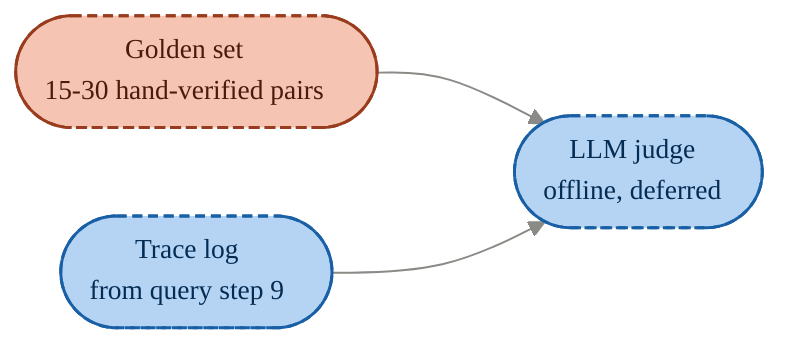

# insurance_rag — pipeline flow

Source of truth: `docs/architecture.md`. Update this diagram in the same commit whenever architecture.md changes.

🟧 You &nbsp;&nbsp; 🟪 Claude Code &nbsp;&nbsp; 🟩 Gemini &nbsp;&nbsp; 🟦 System &nbsp;&nbsp;|&nbsp;&nbsp; solid border = built · dashed = not built · gold border = today's focus

---

## Ingestion pipeline — one-time / admin-triggered

```mermaid
%%{init: {"theme": "base", "themeVariables": {"fontFamily": "Helvetica, Arial, sans-serif", "fontSize": "14px", "lineColor": "#8a8a86", "primaryTextColor": "#2C2C2A"}, "flowchart": {"curve": "basis", "nodeSpacing": 45, "rankSpacing": 70}}}%%
flowchart LR
    classDef you fill:#F5C4B3,stroke:#993C1D,color:#4A1B0C,stroke-width:1.5px
    classDef claudeDashed fill:#CECBF6,stroke:#534AB7,color:#26215C,stroke-width:1.5px,stroke-dasharray:5 3
    classDef geminiFocus fill:#C0DD97,stroke:#EF9F27,color:#173404,stroke-width:2.5px,stroke-dasharray:5 3
    classDef systemDashed fill:#B5D4F4,stroke:#185FA5,color:#042C53,stroke-width:1.5px,stroke-dasharray:5 3

    I1(["1. Upload PDFs to GitHub"]):::you
    I2(["2. Extraction — Gemini 3.1 Pro<br/>raw PDF → Layer 1 JSON"]):::geminiFocus
    I2b(["2b. Layer 2 derivation<br/>same call, 2nd reasoning pass"]):::geminiFocus
    I3(["3. Chunking<br/>structure-aware"]):::claudeDashed
    I4(["4. Embedding<br/>Voyage voyage-law-2"]):::systemDashed
    I5(["5. Load into Qdrant<br/>Layer 1+2+3"]):::systemDashed

    I1 --> I2 --> I2b --> I3 --> I4 --> I5
```

---

## Query pipeline — recurring, user-facing

```mermaid
%%{init: {"theme": "base", "themeVariables": {"fontFamily": "Helvetica, Arial, sans-serif", "fontSize": "14px", "lineColor": "#8a8a86", "primaryTextColor": "#2C2C2A"}, "flowchart": {"curve": "basis", "nodeSpacing": 40, "rankSpacing": 65}}}%%
flowchart LR
    classDef youDashed fill:#F5C4B3,stroke:#993C1D,color:#4A1B0C,stroke-width:1.5px,stroke-dasharray:5 3
    classDef systemDashed fill:#B5D4F4,stroke:#185FA5,color:#042C53,stroke-width:1.5px,stroke-dasharray:5 3
    classDef geminiDashed fill:#C0DD97,stroke:#3B6D11,color:#173404,stroke-width:1.5px,stroke-dasharray:5 3

    Q1(["1. Collect profile<br/>+ concerns"]):::youDashed
    Q2(["2. Session handler<br/>slot-filling"]):::systemDashed
    Q3(["3. Eligibility filter<br/>Group C + concern OR-pass"]):::systemDashed
    Q4{"4. Fewer than<br/>3 matches?"}
    Q4a(["Relax SA/age/term<br/>budget not relaxed"]):::systemDashed
    Q5(["5. Premium interpolation<br/>+ budget filter<br/>interpolation quality unvalidated"]):::geminiDashed
    Q6(["6. Narrative retrieval<br/>restricted to survivors"]):::systemDashed
    Q7(["7. Rerank + sort<br/>tolerance band uncalibrated"]):::systemDashed
    Q8(["8. Narrative generation<br/>Gemini flash-lite, top 3"]):::geminiDashed
    Q9(["9. Trace log write<br/>async"]):::systemDashed
    Q10(["10. BYOK check<br/>governs steps 5 & 8"]):::systemDashed

    Q1 --> Q2 --> Q3 --> Q4
    Q4 -->|yes| Q4a --> Q5
    Q4 -->|no| Q5
    Q5 --> Q6 --> Q7 --> Q8 --> Q9 --> Q10

    class Q4 systemDashed
```

---

## Evaluation

